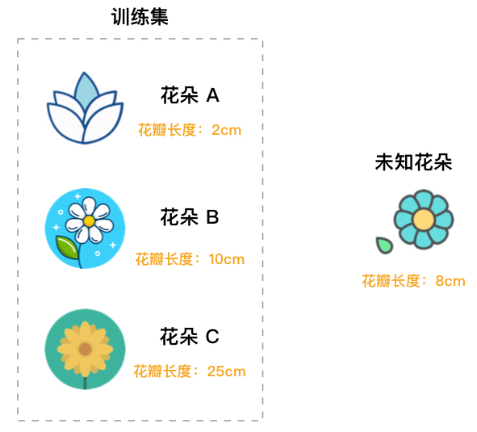
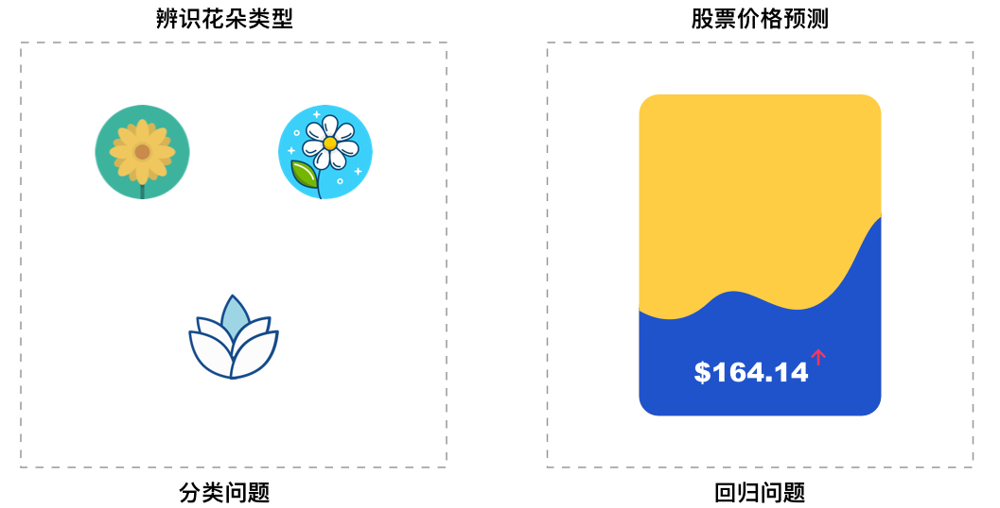
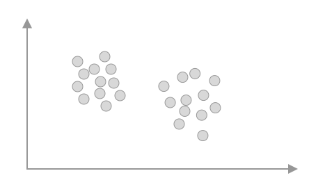
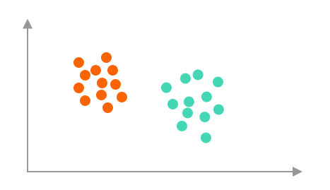

# 机器学习综述及示例
### 介绍

机器学习是概率论、统计学、计算理论、最优化方法、以及计算机科学组成的交叉学科，其主要的研究对象是如何从经验中学习并改善具体算法的性能。本次试验将介绍机器学习的概念及相关细分类别。

**知识点**

- 机器学习介绍
- 监督学习介绍
- 无监督学习介绍

### 机器学习介绍

[<i aria-hidden="true" class="fa fa-external-link-square"> 机器学习</i>](https://zh.wikipedia.org/zh-hans/机器学习) Machine Learning 是人工智能的一个分支，其核心构成为机器学习算法，并通过从数据中获取经验来改善自身的性能。机器学习的诞生时间很早，但随着近些年计算机技术及相关领域的迅速发展，机器学习再一次变得热闹起来。

想要了解什么是机器学习？我们从机器学习的定义开始。其中，一个十分经典的定义来自于计算机科学家  [TOM M.Mitchell](http://www.cs.cmu.edu/~tom/) 于 1997 年出版的《机器学习》专著，这句话的原文如下：

> A computer program is said to learn from experience E with respect to some class of tasks T and performance measure P if its performance at tasks in T, as measured by P, improves with experience E.
> 
> 对于某类任务 T 和性能度量 P ，如果一个计算机程序在 T 上以 P 衡量的性能随着经验 E 而自我完善，那么我们称这个计算机程序在从经验 E 学习。

你可能会觉得上面这句定义太学术，甚至读了多遍都没有理解到其中要准确表达的意思。简单来讲，这句话强调的是「学习」，而核心意义就是：计算机程序通过累计经验来获得性能的提升。

其中，计算机程序的核心就是我们所说的「机器学习算法」，而机器学习算法则来源于基础数学理论和方法。有了可以自主学习的算法，程序就可以从训练数据中自动分析获得规律，并利用规律对未知数据进行预测。

**机器学习 & 深度学习 & 人工智能**

我们经常会从媒体报道及学术资料中看到机器学习、深度学习、人工智能三个不同的名词，但往往又捉摸不透几者之间的关系。它们之间是包含，交叉，还是完全独立呢？

这里，我们引用资深科技记者  [Michael Copeland](https://blogs.nvidia.com/blog/author/michaelcopeland/) 文章中的部分观点进行解释。三者中，最先出现的概念是人工智能，它是于 1956 年由 John McCarthy 提出。当时，人们渴望设计出一种「能够执行人类智能特征任务的机器」。

之后，研究人员构思出机器学习的概念，而机器学习的核心是寻求实现人工智能的方法。于是就出现了朴素贝叶斯、决策树学习、人工神经网络等众多机器学习方法。其中，人工神经网络（ANN）是模拟大脑生物结构的一种算法。

再到后来，就出现了深度学习。深度学习的关键在于建立具有更多神经元、更多层级的深度神经网络。我们发现，这种深度神经网络的学习效果在图像辨识等方面甚至超越了人类。

所以，关于上述 3 个概念，可以总结出如下所示的关系图。其中，机器学习是实现人工智能的手段，而深度学习只是机器学习中的一种特定方法。

目前，我们通常所说的「机器学习」大致包含四大类： [监督学习](https://en.wikipedia.org/wiki/Supervised_learning)，英文为 Supervised Learning； [无监督学习](https://en.wikipedia.org/wiki/Unsupervised_learning)，英文为 Unsupervised Learning； [半监督学习](https://en.wikipedia.org/wiki/Semi-supervised_learning)，英文为 Semi-supervised Learning； [强化学习](https://en.wikipedia.org/wiki/Reinforcement_learning)，英文为 Reinforcement Learning。

本次课程中，我们重点学习监督学习和无监督学习相关的方法。其中，监督学习通常解决分类和回归问题，无监督学习主要解决聚类问题，其又被细分为数十种不同的算法。

接下来，我们重点了解监督学习和无监督学习的概念，以及分类、回归、聚类到底是怎样一回事。

### 监督学习方法

要想了解监督学习，首先从定义展开。

关于  监督学习 的定义，这里引用著名机器学习专家  Mehryar Mohri 在其专著 Foundations of Machine Learning 中的叙述：

> Supervised learning is the machine learning task of learning a function that maps an input to an output based on example input-output pairs. It infers a function from labeled training data consisting of a set of training examples.
>
>监督学习是基于示例输入-输出数据对，在输入和输出数据之间建立数学函数的机器学习任务，而该数学函数来源于对有标签训练数据集的学习过程。

解释一下这句话中的几个关键词。示例输入和输出数据对其实就是训练数据集，而输入指的是训练数据集中的特征变量，输出则是标签。而建立数学函数，实际就是训练机器学习预测模型。这句话，其实就是一个典型的机器学习过程。而监督学习的关键在于，这里提供的训练数据集有标签。

**监督学习示例**

为了更好地理解上面关于监督学习的定义，下面举一个判断花朵种类的例子。

如图所示，训练数据集给出了 3 种不同花朵的花瓣长度特征（训练集特征），我们已经知道这 3 朵花的种类 A，B，C（标签）。那么，对于一朵未知种类的花，就可以根据它的花瓣长度（测试样本特征）来判断它所属种类（测试样本标签）。下图中，未知花朵判断成 B 类肯定更合适一些。

综上，监督学习中的「监督」就体现在训练集具有「标签」。就像上图中，我们给出了已知种类的花，对于未知种类的花就根据特征去比较就可以了。

**分类与回归**

通过上面的小例子，你应该对「监督学习」有一定印象了。而类似于上面这种识别类别的问题，我们一般称之为监督学习的分类问题。分类其实是一种最常见的问题类型，例如：动物的种类判断、植物的种类判断、各类物品的种类判断等。

除了分类问题，监督学习中还有十分重要的一类，那就是回归问题，这也就是本周需要学习的内容。首先，回归问题和分类问题一样，训练数据都包含标签，这也是监督学习的特点。而不同之处在于，分类问题预测的是类别，回归问题预测的是连续实数值。

例如，股票价格预测，房价预测，洪水水位线预测，这都是机器学习回归问题。因为我们需要预测的目标都不是类别，而是实数值。

### 无监督学习介绍

在监督学习的介绍中，我们曾经引用了著名机器学习专家 Mehryar Mohri 的叙述。其强调了，当监督学习算法去数据集中积累经验时，很关键的一点在于训练数据集是有标签的。数据带有标签用通俗的话来讲，就是我需要告诉算法这个是房子，这个是人，这个是花，然后它就慢慢学会认识这些事物了。

但是，生活中我们遇到的大部分数据它是没有标签的。真的，如果你留意的话，你会发现无标签数据相对于有标签数据要多很多，为什么呢？

因为给数据添加标签是一个十分繁重的工作呀！你在监督学习中用到的鸢尾花数据集、手写字符数据集都是需要人工去添加标签的。想想如果需要给几十万、上百万的数据添加标签，需要多大的工作量？

不过，面对无标签数据，我们还有一类机器学习方法叫做无监督学习。

**无监督学习示例**

[无监督学习](https://en.wikipedia.org/wiki/Unsupervised_learning) 是面对无标签数据常常使用的一类机器学习方法，而通常我们用得较多的就是数据聚类。

数据聚类，形象的介绍就是把一堆数据按照它们特征的相似度分为多个子类。例如，我们手中有一个花朵数据集，包含有叶片长度和宽度两个特征。我们可以根据这两个特征将其在二维平面中可视化。

如上图所示，你通过肉眼就能发现，全部数据很明显呈现出 2 个不同的类别（簇）。这也就说明，我们的数据集中很大可能是采集了来自于 2 种花的特征。此时，如果你知道该数据集的特征来自于哪两种花，我们就可以迅速的完成数据标记，给整个数据集打上标签。也就是说，可通过聚类的手段，给无标签数据集添加标签。

所以说，无监督学习的「力量」是很大的，它不仅可以用于数据的聚类，同时还能帮助我们给数据集添加标签。于是，很多机器学习的流程其实就变成了：

当然，数据聚类只是无监督学习中的主要任务。无监督学习实际上还包括数据降维、图分析、关联规则分析等。

### 小结

本次实验，我们重点了解了机器学习及细分类别的概念。你需要对监督学习和无监督学习有充分的认识，并明白其本质区别。此外，对于回归问题、分类问题、聚类问题的特点及所解决的问题有直观上的认识和理解。

相关链接
: [机器学习-维基百科](https://zh.wikipedia.org/wiki/机器学习)